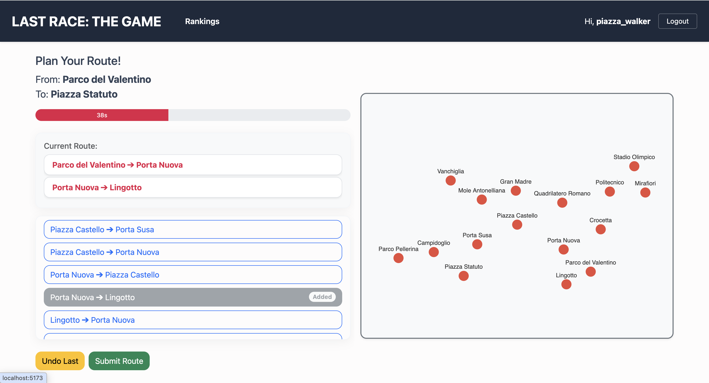
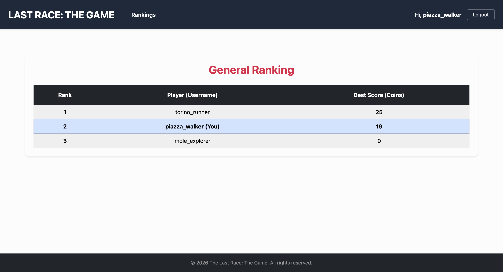

# Exam #N: "Exam Title"
## Student: s360263 Bagnolini Matteo 

## React Client Application Routes

- Route `/`: unauthenticated user homepage, with game instruction and the possibility to browse to the login page. If the user is logged in, it also allows to play a new game.
- Route `/login`: login page.
- Route `/logout`: logout user.
- Route `/play`: route to start a new game.
- Route `/ranking`: display the live ranking of players.
- Route `/*`: fallback route for 404 not found.

## API Server

### Authentication

- POST `/api/sessions`

    - Description: perform the login of a user.
    - Request body:
    ```json
    {
        "username": "torino_runner",
        "password": "password123!"
    }
    ```
    - Response body:
    ```json
    {
        "userId": "1",
        "username": "torino_runner"
    }
    ```
    - Status codes: `200 OK`, `400 Bad Request`, `401 Unauthorized` , `500 Internal Server Error`

- GET `/api/sessions/current`
    - Description: return information about the current logged user. User must be authenticated.
    - Response body:
    ```json
    {
        "userId": "1",
        "username": "torino_runner"
    }
    ```
    - Status codes: `200 OK`, `401 Unauthorized`, `500 Internal Server Error`

- DELETE `/api/session/current`
    - Description: logout the current logged user.
    - Status codes: `200 OK`, `401 Unauthorized`, `500 Internal Server Error`

### Stations

- GET `/api/stations`
    - Description: return a list of all available stations. User must be authenticated.
    - Response body:
    ```json
    [
        {
            "stationId": "1",
            "stationName": "Piazza Statuto"
        },
        {
            "stationId": "2",
            "stationName": "Porta Susa"
        }
    ]
    ```
    - Status codes: `200 OK`, `401 Unauthorized`, `500 Internal Server Error`

### Metro Lines

- GET `/api/lines`
    - Description: return a list of all available metro lines. User must be authenticated.
    - Response body:
    ```json
    [
        {
            "lineId": "1",
            "lineName": "Line 1 - Red"
        },
        {
            "lineId": "2",
            "lineName": "Line 2 - Blue"
        }
    ]
    ```
    - Status codes: `200 OK`, `401 Unauthorized`, `500 Internal Server Error`

### Connections

- GET `/api/connections`
    - Description: return a list of connections between any two stations. User must be authenticated.
    - Response body:
    ```json
    [
        {
            "startingStationId": "1",
            "arrivingStationId": "2",
            "metroLineId": "1"
        }
    ]
    ```
    - Status codes: `200 OK`, `401 Unauthorized`, `500 Internal Server Error`

### Games

- POST `/api/games/setup`
    - Description: setup a new game, returning an object with the starting station and destination station. User must be authenticated.
    - Response body:
    ```json
    {
        "startingStationId": "1",
        "destinationStationId": "5",
    }
    ```
    - Status codes: `201 Created`, `401 Unauthorized`, `500 Internal Server Error`

- POST `/api/games/:gameId/route`
    - Description: sends a user created route, which is an ordered list of stations. The response contains if the route is valid/invalid, the final score and an ordered list of the corresponding events. The game represented by gameId is expected to be in the `pending` status (i.e., not completed yet).  User must be authenticated.
    - Request body:
    ```json
    {
     "route":
        [
            {
                "stationId": "1"
            },
            {
                "stationId": "2"
            }
        ]
    }
    ```
    - Response body:
    ```json
    {
        "valid": true,
        "finalScore": 24,
        "events": [
            {
                "eventId": "1",
                "description": "Pickpocketed near Piazza Castello! You lost your emergency stash.",
                "coins": -4
            }
        ]
    }
    ```
    - Status codes: `200 OK`, `400 Bad Request`, `401 Unauthorized`, `404 Not Found` (if `gameId` refers to a game not created by the currently logged in user), `500 Internal Server Error`

- GET `/api/games/scores`
    - Description: returns a list of objects representing the best score for each user. User must be authenticated.
    - Response body:
    ```json
    [
        { "username": "torino_runner", "bestScore": 24 },
        { "username": "mole_explorer", "bestScore": 0 }
    ]
    ```
    - Status codes: `200 OK`, `401 Unauthorized`, `500 Internal Server Error`

## Database Tables

- Table `users` - contains userId, username, hashedPassword, salt
- Table `stations` - contains stationId, stationName
- Table `metroLines` - contains lineId, lineName
- Table `connections` - contains startingStationId, arrivingStationId, metroLineId
- Table `events` - contains eventId, description, coins
- Table `games` - contains gameId, userId, startingStationId, destinationStationId, status, score 

## Main React Components

- `Home` (in `Home.jsx`): displays the home page, with the rules and the possibility to login and start a new game.
- `LoginForm` (in `LoginForm.jsx`): form to perform the login action of previously registered user.
- `Play` (in `Play.jsx`): component used to play the game. It implements a finite state machine, and based on the state of the current game, it displays one of the following components: `GameSetup` , `GamePlanning`, `GameExecution`, `GameResults` (inside the `gameComponents` folder). These components implements the different phases of the game.
- `NetworkDisplay` (in `NetworkDisplay.jsx`): displays the network graph (stations, connections and lines).
- `Ranking` (in `Ranking.jsx`): shows the player's ranking.

## Screenshot




## Users Credentials

- torino_runner, password123!
- mole_explorer, password1234!
- piazza_walker, password12345!

## Use of AI Tools
Briefly describe whether you used any AI tools (e.g., ChatGPT, GitHub Copilot, Claude) while working on this project, for which purposes (e.g., clarifying concepts, debugging, generating code), and how you verified or adapted their output.
If you did not use any AI tools, simply state so.

I used AI (Gemini chatbot) to help me developing these parts of the project:
- Database initialization and seeding script
- Website presentation text and image (mainly the rules text and image in the homepage)
- Bootstrap classes for the visual style of the website
- Network graph through `ForceGraph2D` library
- Add documentations and comments in the code

The AI output has been verified manually, reading all lines of code / text produced to check if it was the correct choice, and then manually implemented in the source code. No AI agents has been used in this project.
